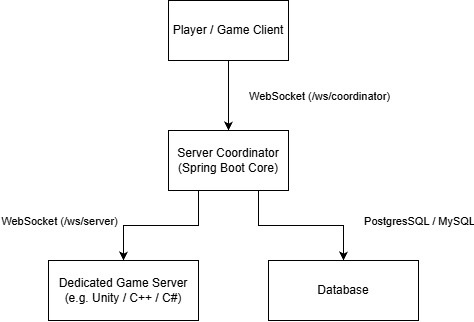

# ProjectArchCoordinator - Example of a game coordinator server implementation


---

## 🌟 Highlights

A high-performance coordination backend service based on Spring Boot and WebSockets, designed for centralized player authentication, monitoring of available game servers, and secure matchmaking/connection routing.

---

## ℹ️ Overview

**ProjectArchCoordinator** is a high-performance coordination backend service based on Spring Boot and WebSockets, designed for centralized player authentication, monitoring of available game servers, and secure matchmaking/connection routing.

The project addresses the task of decoupling network matchmaking logic from the gameplay process: clients connect to the coordinator via a duplex WebSocket channel, undergo JWT authentication, and receive lists of available instances along with a secure one-time token (handshake secret) for direct connection to a dedicated game server.

---

## 🚀 Key Features

- **Dual-channel WebSocket architecture:**
- - /ws/coordinator - a client gateway for authentication, querying available servers, and initiating match entry.
- - /ws/server - internal protocol for dedicated server management and synchronization (instance registration, transmission of player count metrics, slot validation).
- **A full-fledged JWT authorization pipeline:**
- - Separation into Access (short-lived) and Refresh (long-lived) tokens, with rotation in the database (refresh_tokens).
- - Protection against compromise: single-use refresh tokens (isUsed) and immediate revocation upon any attempt to reuse an outdated token.
- - Password hashing using the BCrypt algorithm.
- **Concurrent Matchmaking & RPC Coordination:**
- - Asynchronous player slot reservation on a game server using correlation IDs and CompletableFuture.
- - Request timeouts (5 seconds) for space reservation: the client is protected against hanging in the event of an instance or network failure.
- - Generation of a unique, one-time connection key (ConnectionKey) that prevents unauthorized access to the game server by bypassing the coordinator.
- **Concurrent Session Management:**
- - Thread-safe session stores (ConcurrentHashMap).
- - Eviction of old connections (Single Session Policy): upon re-authorization from a different location, the player's previous session is forcibly terminated with the code `auth_another_login`.

---

## 🏗 System Architecture

The architecture is based on the Centralized Session Coordinator pattern (Director / Lobby Coordinator Pattern):



Data flow when a player connects to a match (Matchmaking Flow):

1. The client sends a `FIND_SERVER` command with the type `CONNECT_TO` and the target `serverId`
2. The coordinator verifies the client's rights and generates a `correlationId` and a `ConnectionKey` pair (player ID + secret).
3. The coordinator places the request on hold via the `ServerRpcManager` and sends a `CONNECTION (CONNECT)` command to the corresponding game server.
4. The game server checks limits, reserves a slot, and responds with a confirmation containing the same `correlationId`.
5. The coordinator resolves the `CompletableFuture` and sends the client the network address (`IP:port`) and a secret key for a direct UDP/WebSocket connection to the game session.

---

## 📂 Repository Structure

```text
.
├── src
│   ├── main
│   │   ├── java
│   │   │   └── com
│   │   │       └── VER7U7
│   │   │           ├── auth                  # Token and Cryptography Management
│   │   │           │   └── JwtService.java   # HMAC JWT generation, parsing and validation
│   │   │           ├── config                # Spring Context Configurations
│   │   │           │   ├── SecurityConfig.java    # Spring Security filters (WS access)
│   │   │           │   └── WebSocketConfig.java   # WebSocket endpoint registration
│   │   │           ├── data                  # Internal state models in memory
│   │   │           │   └── GameServerData.java    # Game server instance metadata
│   │   │           ├── dto                   # Data Transfer Objects
│   │   │           │   ├── client            # Game client communication contracts
│   │   │           │   ├── common            # Common structures (tokens, WsMessage wrapper)
│   │   │           │   └── game              # Game server communication contracts
│   │   │           ├── exceptions            # Domain exceptions (tokens, accounts)
│   │   │           ├── models                # JPA Database Entities
│   │   │           │   ├── PlayerAccount.java     # Player accounts
│   │   │           │   └── RefreshToken.java      # Refresh token storage
│   │   │           ├── repo                  # Data Access Repositories (Spring Data JPA)
│   │   │           │   ├── PlayerAccountRepository.java
│   │   │           │   └── RefreshTokenRepository.java
│   │   │           ├── service               # Application business logic
│   │   │           │   ├── ClientAuthService.java # Registration, login, sessions
│   │   │           │   ├── GameServerService.java # Server registry and load balancing
│   │   │           │   └── ServerRpcManager.java  # Asynchronous RPC over WebSockets
│   │   │           ├── utils                 # Enumerations and utility helpers
│   │   │           │   ├── ConnectionType.java    # Server communication event types
│   │   │           │   ├── ServerRegion.java      # Geographic regions
│   │   │           │   ├── SHA256Encryptor.java   # Data hashing
│   │   │           │   └── TraceUtils.java        # Trace logging utilities
│   │   │           └── websock               # WebSocket transport layer
│   │   │               ├── handlers          # Entry points and message routers
│   │   │               │   ├── client        # Client action handlers (Auth, Match)
│   │   │               │   ├── server        # Dedicated server action handlers
│   │   │               │   ├── ServerCoordinator.java # Game Server Dispatcher
│   │   │               │   └── SocketCoordinator.java # Client Manager
│   │   │               └── sessions          # Active network connection managers
│   │   │                   ├── ClientSessionManager.java
│   │   │                   └── ServerSessionManager.java
│   │   └── resources
│   │       ├── application.properties        # Database parameters, JWT secrets, and token lifetimes
│   │       └── log4j2.xml                    # Log4j2 logging configuration
│   └── test
│       └── java
│           └── com
│               └── VER7U7
│                   └── service               # Unit and integration tests
│                       └── ClientAuthServiceTest.java
├── pom.xml                                   # Maven Dependency Specification
└── README.md
```
---

## 🧵 Getting Started
### Prerequisites
#### Backend
- Java 21 or newer
- Maven

### 1. Start the Java Backend
```bash
mvn clean
mvn compile
mvn package
java -jar target/platform.jar
```
### 2. Run client and server
```text
will be added soon
```

---

## 🛣️ Roadmap
- [-] Add tests for all functional classes.
- [-] I'll come up with something to cure the boredom :3

---

## 🤝 Contributing
Contributions are welcome.

1. Fork the repository
2. Create a feature branch
3. Commit changes
4. Open a Pull Request

Please ensure:
- Code follows project conventions
- Networking changes remain backward compatible

---

## 📄 License

This project is licensed under the **MIT License**.

See the [LICENSE](LICENSE) file for details.
---
### ✍️ Authors

**[Author](https://github.com/VER7U7)**
